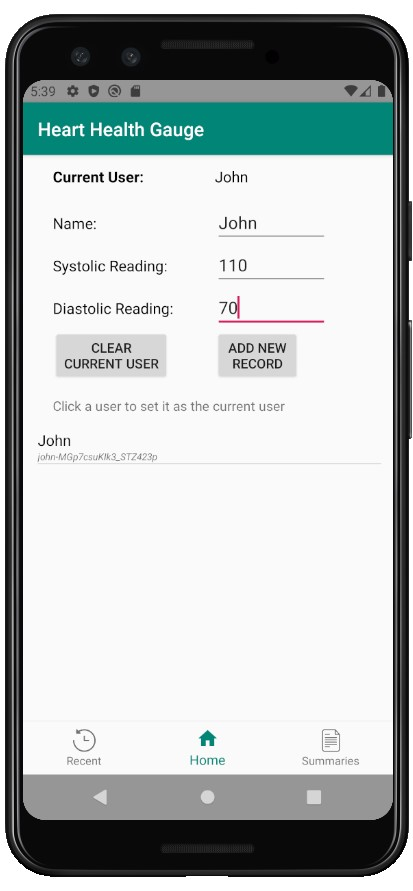
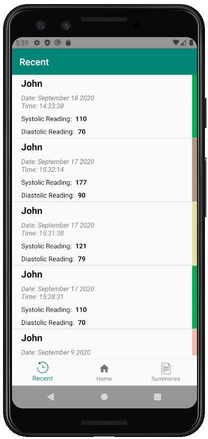
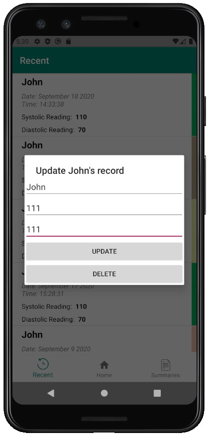
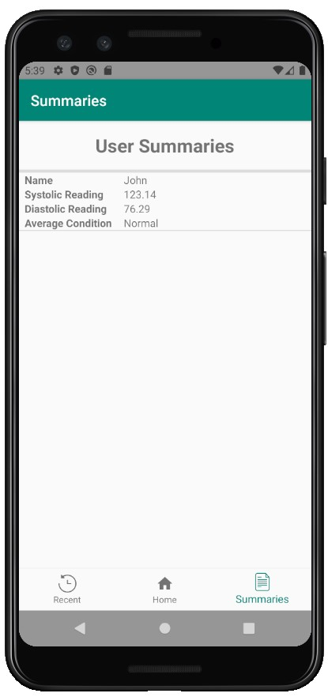

# Heart Health Gauge

### What is Heart Health Guage?
Aimed towards patients at high risk for heart disease, this app lets users track blood pressure. Data can be saved for backup, analysis and sharing with doctors and family members.

### Download apk
Check out the releases section of the repository to download the latest apk.

### App in use
__Opening Screen__: Lets you quickly add current blood pressure recording.
 

 
__Recents Tab__: Sorted list of all your blood pressure recordings. Note that there is also a colored indicator on the side for each record showing the severeness of the condition.
 

 
__Update/Delete record__: You can touch and hold on a particular record to edit and delete it.
 

 
__Monthly Summary__: Summarizing all your records and showing overall heart condition.
 

 

